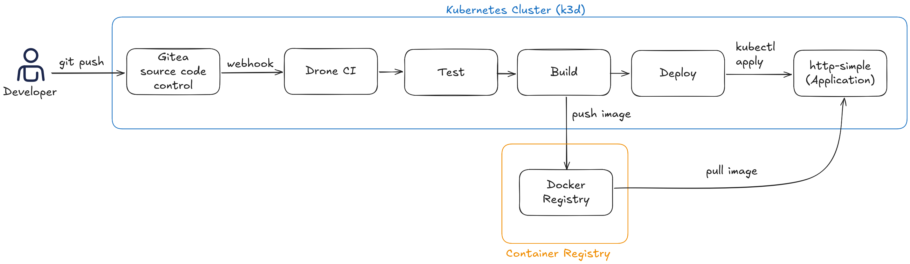
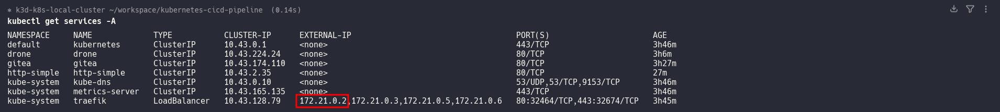
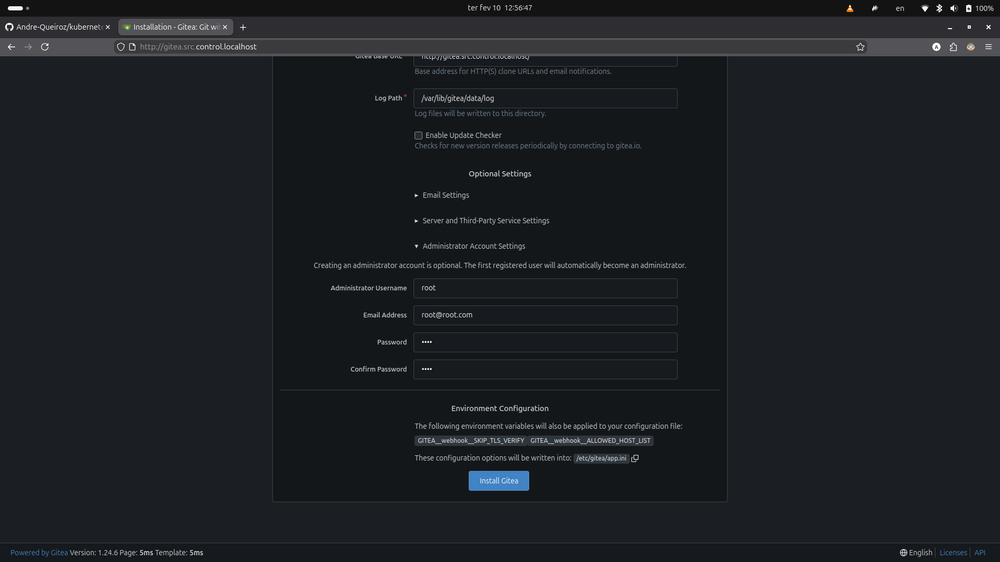
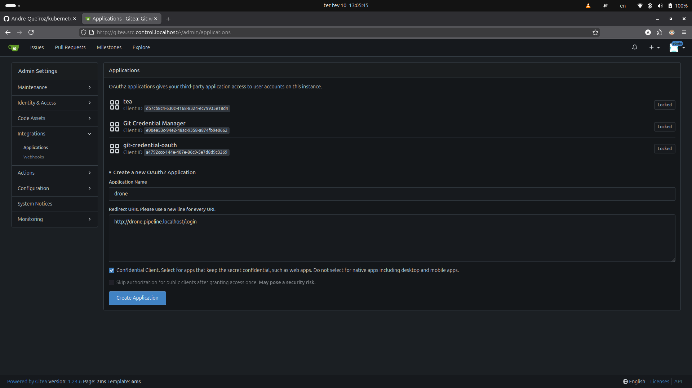
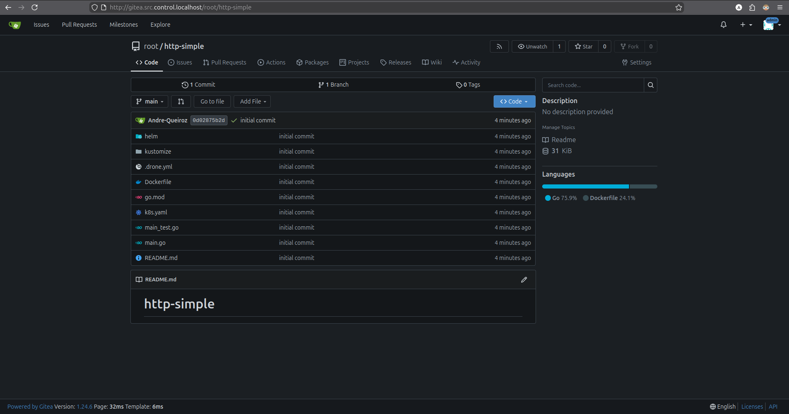
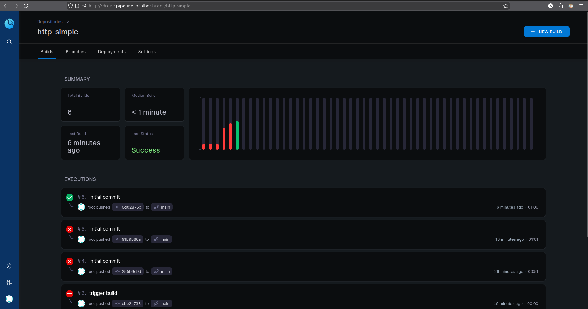
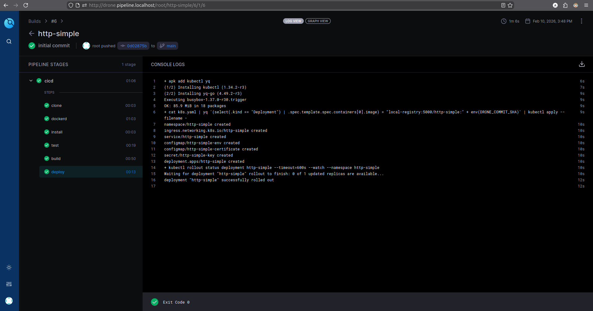
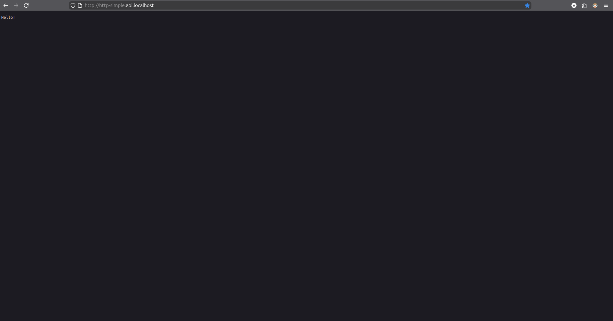

# End-to-End Local CI/CD Pipeline on Kubernetes

A local CI/CD platform running on Kubernetes, featuring self-hosted Git source control and fully automated pipelines.

## Overview

This project showcases a complete end-to-end DevOps workflow by implementing a local Kubernetes cluster with fully self-hosted infrastructure. It demonstrates automation across the entire software delivery lifecycle, from code commit to deployment.

### Key Highlights

- **Self-Hosted Infrastructure:** Complete Git and CI/CD stack running on Kubernetes  
- **Automated Pipeline:** Build, test, and deployment automation  
- **Multi-Environment Support:** QA and Production configurations using Helm and Kustomize  
- **Container-Native:** Docker-in-Docker builds with private registry integration  
- **GitOps Ready:** Infrastructure and application deployments managed as code  

## Architecture



### Technology Stack

| Component | Technology | Purpose |
|-----------|-----------|---------|
| Orchestration | Kubernetes (k3d) | Container orchestration platform |
| Git Server | Gitea | Self-hosted Git service |
| CI/CD | Drone | Kubernetes-native CI/CD pipeline |
| Container Runtime | Docker-in-Docker | Container image building |
| Registry | Docker Registry | Private container image storage |
| Package Manager | Helm & Kustomize | Kubernetes deployment management |
| Application | Go (Golang) | Sample microservice API |

## Features Implemented

### Infrastructure as Code
- Declarative Kubernetes manifests for all components  
- Version-controlled infrastructure configuration  
- Reproducible environment setup  

### CI/CD Pipeline
- Automated dependency installation  
- Unit test execution  
- Docker image build with commit-based tagging  
- Automated deployment to Kubernetes  
- Rollout status monitoring  

### Multi-Environment Deployments
- Helm charts with QA and Production values  
- Kustomize environment-specific overlays (`hom` / `prd`)  
- Environment variable management  
- Resource scaling per environment  

### Security & RBAC
- Kubernetes Service Accounts  
- Role-Based Access Control (RBAC)  
- ClusterRole and RoleBinding configurations  
- Namespaced resource isolation  

### Cloud-Native Best Practices
- Multi-stage Docker builds for optimized images  
- Health checks and readiness probes  
- Stateful workloads with persistent volumes  
- Ingress routing for external access

## Quick Start

### Prerequisites

- Docker
- k3d (k3s in Docker)
- kubectl

### Setup Instructions

#### Create the Kubernetes cluster with integrated registry:

```bash
k3d cluster create k8s-local-cluster \
--agents 3 \
--port 80:80 \
--registry-create local-registry
```

```bash
kubectl get services -A
```



Retrieve one of the Traefik `EXTERNAL-IP`s and configure it in the project `hostAliases`.


#### Deploy Gitea (Git Server):

```bash
kubectl apply -f gitea.yaml
```

#### Configure Gitea

- Access: http://gitea.src.control.localhost  
- Complete the initial setup 

   

- Create OAuth application for Drone integration using

   

#### Deploy Drone CI/CD

- Set `DRONE_GITEA_CLIENT_ID`  
- Set `DRONE_GITEA_CLIENT_SECRET`  

```bash
kubectl apply -f drone.yaml
```

- Create a repository in Gitea

- Activate Repository in Drone:
   - Access: http://drone.pipeline.localhost
   - Activate the http-simple repository (mark as `Trusted` repository)

```bash
kubectl apply -f drone-runner.yaml
```

#### Deploy the Application:

- Trigger a build by pushing code changes
- The pipeline automatically deploys on successful builds

## CI/CD Pipeline Workflow

The `.drone.yml` pipeline executes the following stages:

1. **Install**  
   Download Go dependencies.

2. **Test**  
   Run unit tests to validate the codebase.

3. **Build**  
   - Build the Docker image using the commit SHA as the image tag  
   - Push the image to the private registry (`local-registry:5000`)

4. **Deploy**  
   - Update the Kubernetes deployment with the new image

## Results

### Repository hosted on Gitea



### Drone CI builds



### Pipeline running successfully



### Deployed application

http://http-simple.api.localhost/


